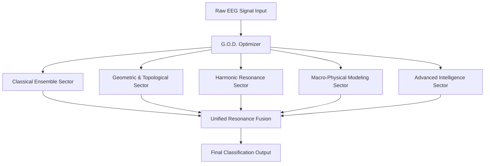

# HRF Titan-26 Architecture

This document proposes the conceptual Titan-26 architecture for future expansion of the HRF system.

## Overview

HRF Titan-26 represents a proposed 26-dimensional extension of the current HRF architecture, combining:
- Classical ML ensembles
- Geometric/topological models
- Harmonic wave-based units
- Macro-physical modeling layers
- Advanced neural architectures

All components are dynamically orchestrated by the G.O.D. (General Omni Dimensional) Optimizer.


## Titan-26 Architectural Flow
### ASCII Diagram
```text
                             +----------------------+
                             |   Raw EEG Signal     |
                             +----------+-----------+
                                        |
                                        v
                    +---------------+--------------------------+
                    |       G.O.D. Optimizer Engine            |
                    |   (General Omni Dimensional Optimizer)   |
                    +--------------------+---------------------+
                                         |
       ---------------------------------------------------------------------------
       |                |                  |                   |                 |
       v                v                  v                   v                 v

+-------------+  +----------------+  +---------------+  +-------------+  +----------------+
| Classical   |  | Geometric &    |  | Harmonic Wave |  | Macro-      |  | Advanced       |
| Ensemble    |  | Topological    |  | Resonance     |  | Physical    |  | Intelligence   |
| Sector      |  | Sector         |  | Sector        |  | Sector      |  | Sector         |
+------+------+  +--------+-------+  +--------+------+  +------+------+  +--------+-------+
       |                 |                  |                 |                  |
       |                 |                  |                 |                  |
       v                 v                  v                 v                  v

  ExtraTrees       Polynomial SVM      RBF Resonance       Entropy          Fractal Mirror
  Random Forest    KNN Local/Global    Twin Resonance      Gravity          Omega Neural ELM
  XGBoost          QDA                 Soul Kernels        Quantum          Residual Units

      ------------------------------------------------------------------------------
                                          |
                                          v
                           +---------------+----------------+
                           |  Unified Resonance Fusion      |
                           +---------------+----------------+
                                          |
                                          v
                                +----------+-----------+
                                | Final Classification |
                                +----------------------+
```


### Mermaid.js Visualization


## Core Processing Pipeline

The proposed Titan-26 architecture is designed to process physiological signals through multiple resonance-aware computational layers. Each sector contributes a specialized interpretation of the incoming signal before unified resonance fusion generates the final prediction.

The processing flow begins with raw EEG signal ingestion, followed by multidimensional optimization through the G.O.D. Optimizer. The optimizer conceptually distributes resonance evaluation tasks across five major sectors of the Titan-26 manifold.

## Sector Responsibilities

### Classical Ensemble Sector
Provides baseline statistical learning and ensemble decision formation using tree-based architectures such as Random Forest and ExtraTrees.

### Geometric & Topological Sector
Analyzes nonlinear spatial relationships and manifold geometry using SVM, KNN, and QDA-based locality modeling.

### Harmonic Resonance Sector
Acts as the core wave-processing engine responsible for frequency-aware resonance energy computation and oscillatory signal interpretation.

### Macro-Physical Modeling Sector
Applies entropy analysis, quantum abstractions, and gravity-inspired potential mapping to stabilize multidimensional resonance behavior.

### Advanced Intelligence Sector
Performs high-level adaptive refinement, residual correction, and neural resonance optimization before final fusion.

## Unified Resonance Fusion

Outputs from all Titan-26 sectors are dynamically combined using weighted resonance integration. Instead of relying solely on statistical voting, HRF evaluates harmonic agreement between sectors to determine the dominant classification state.

This resonance-centric fusion mechanism allows HRF to maintain strong robustness against temporal jitter, noisy EEG signals, and phase instability.

## G.O.D. Optimizer

The General Omni Dimensional Optimizer dynamically weights and integrates outputs from all 26 dimensions to produce final classification via resonance energy maximization.


